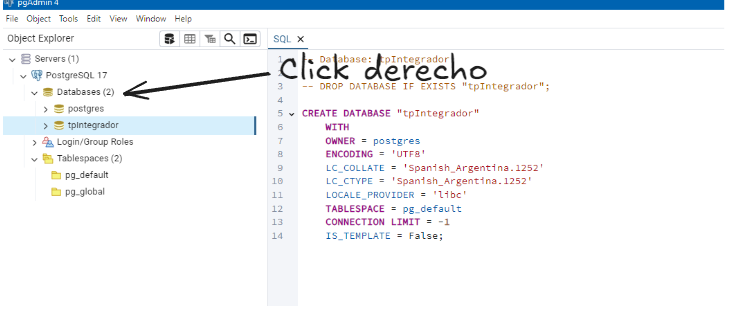
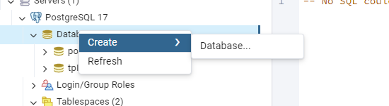
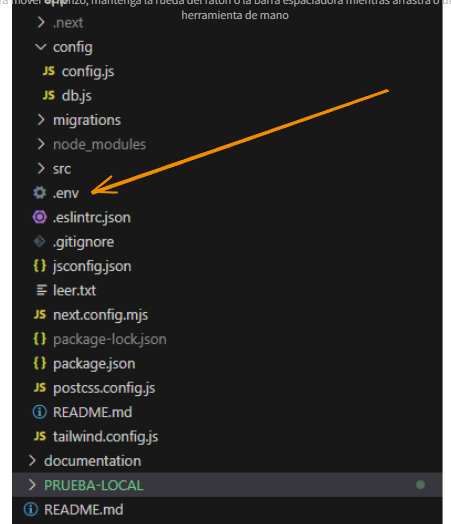
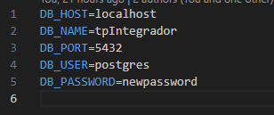
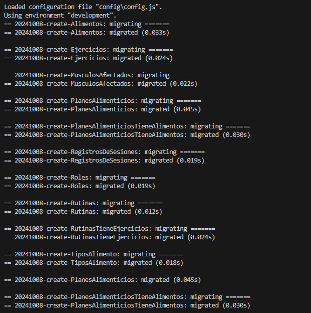
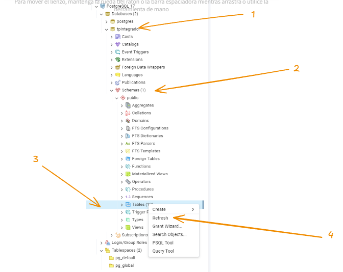

1°: Deben instalar PostgreSQL:https://www.postgresql.org/download/windows/
2°: Una vez instalado deben crear un usuario y contraseña (se recomienda utilizar las dejadas en el archivo '.env' en /app).
3°: Para porbar la BD en local deben crearla desde el pgAdmin 4: --->
4°: Si ya la habian creado, borrenla y vuelvanla a crear.
5°: Una vez creada la BD con su nombre, deben hacer coincidir las variables del '.env' en caso de que las hayan modificado:---->
6°: Para migrar las tablas, deben correr el siguiente comando en la consola: "npm run migrate", el output será: 
7°: Para precargar los datos desde las seed, deben correr el comando: "npm run seed".
8°: Para finalizar deberan refrescar la BD desde el pgAdmin 4.
